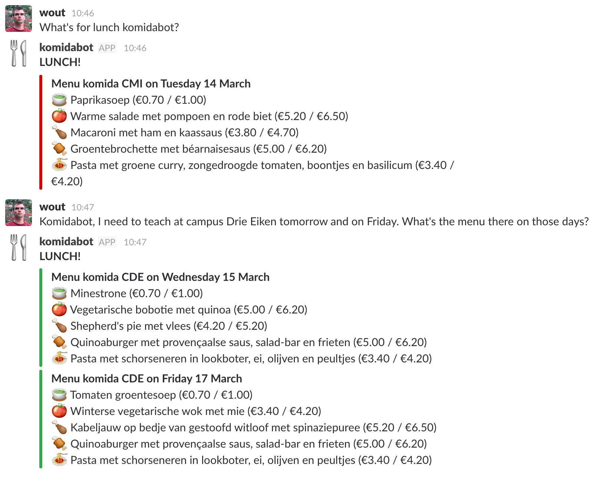

Fork of [Wout Bittremieux's `komidabot`](https://github.com/bittremieux/komidabot), adapted for a Facebook chatbot. This code is provided to the first year students to learn git and ssh.

komidabot
=========

A chat bot to request the daily menu at the [komida restaurants](https://www.uantwerpen.be/en/campus-life/catering/) of the [University of Antwerp](https://www.uantwerpen.be/en/).



About
-----

Komidabot retrieves the [menu for the komida restaurants](https://www.uantwerpen.be/nl/campusleven/eten/weekmenu/) at the University of Antwerp and lets you know what's for lunch on Slack.

There are two modes of operation for the bot. Manual and interactive.

#### Manual
Execute the file `komidabot_manual.py`. This will first trigger an update of the menu, which is stored in the local menu.db sqlite file. After this the menu of the current day is reported.

This can be useful if you want to receive daily updates of the menu. Simply add the following line to your crontab to receive the menu at 10 o' clock on all weekdays:
```
0 10 * * 1-5 python3 /path/to/komidabot_manual.py
```

Note that you need to configure a Facebook page to send the message from. Provide following information in a `.env` file:
 - CAMPUS: The campus of which to report the menu. Default is cmi.
 - FB_TOKEN: FB token of the page where messages are sent from. The following permissions are required: _pages\_messaging_ and _pages\_messaging\_subscriptions_
 - FB_RECEIVER_ID: A Page Scoped User Id (PSID) of the user to send the message. You can use the interactive chatbot to help figure this out. Send `What is my PSID?` to [Komidabot UA](m.me/1502601723123151)

#### Interactive
The Komidabot is hosted on the Facebook page [Komidabot UA](https://www.facebook.com/pg/Komidabot-UA-1502601723123151).
Komidabot will reply to menu requests by:

* Sending a message to the komidabot page, optionally specifying a campus and date. By default it responds with the menu at campus Middelheim of today.
* Campus choices can be specified using the full campus name or the three-letter campus abbreviation (Drie Eiken CDE, Middelheim / CMI, stad / city / CST).
* Dates can be specified using the day of the week (Monday - Sunday) or using temporal nouns (yesterday, today, tomorrow).

You can also run it yourself using the Flask app in `komidabot_interactive.py`. This web server can receive messages from Facebook and replies with the requested menu. Note that this also requires a Facebook app and the appropriate configuration variables (see source code).

Installation
------------

Komidabot was developed using Python 3.6. No guarantees are given that it will work for other Python versions as well. See `requirements.txt` and `requirements_manual.txt` for the dependencies that need to be installed.
